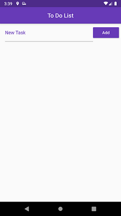
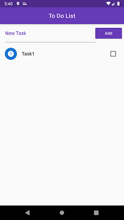
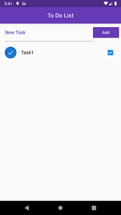
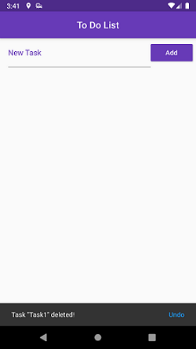

# Task List

- This app simulates a Task List;

- The data is being saved in the device in json format; 

- App Actions:
    - Add a task;
    - Put a task as done;
    - Delete a task;
    - Undo delete.

## Screens

## Author

| **Marcelo Amorim** |
| :---: |
|  |