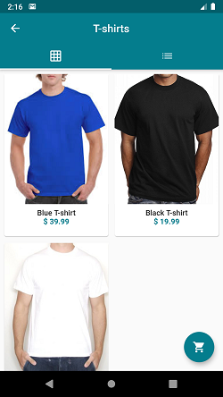

# Virtual Shop

- This app is virtual shop;

- The data is being saved on firebase; 

- There is no payment method;

- App Screens:
    - **Menu**: Shows the options of screens and login;
    - **Log in**: Put your e-mail and password (You can recover your password with your e-mail);
    - **Sign up**: Put your informatios (name, e-mail, address);
    - **Home**: Some images;
    - **Products**: Products categories;
    - **Category name**: Products from a specific category;
    - **Product name**: Specific product info and buy option;
    - **Cart**: The products that you have chosen and some options (Calculate Shipping is disabled);
    - **My Orders**: All your orders updated;
    - **Places**: Physical unit with addres and phone.

 - **APK**: Download it to use the app;

## Screens

## Author

| **Marcelo Amorim** |
| :---: |
|  |